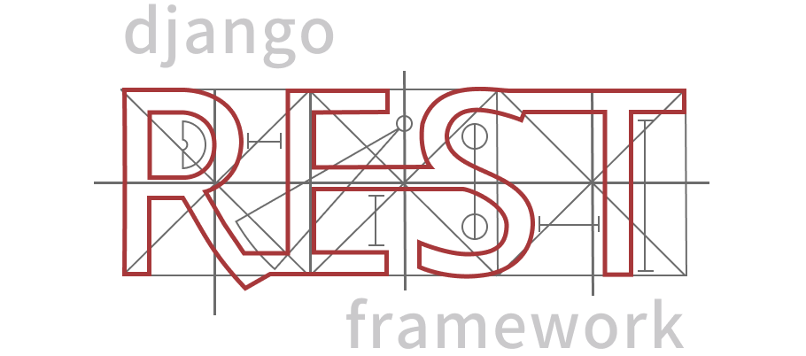

# Core Django Apps

Core Application containing many of the common django apps pre-built production grade. Gives a common application to start a new project not from scratch but from a pre-built prodcution ready setting. The core is meant to be used as a sub-module in your project, just use the app as a submodule in you'r project and configure you'r project taking reference from sample_project.

## Tech Stack

<p align="center">
  
  
  
  
  
  
</p>

---

| Component          | Technologies                                                          |
| :----------------- | :-------------------------------------------------------------------- |
| **Backend**        | django (5.2), django-rest-framework, django-tenants, django-constance |
| **Frontend**       | Vue 3 (Composition API), Vite, Vuetify 3, Pinia                       |
| **Worker/Queue**   | Celery, Valkey                                                        |
| **Database**       | PostgreSQL                                                            |
| **Infrastructure** | Docker, Compose, Poetry, Pre-Commit                                   |

## Core Directory Structure

```
core-django-apps/
|	|- .agents/ 			# Common agentic configs, skills, plugins
|	|- .vscode/				# IDE settings for vscode
|	|- .github/				# Core Github Workflows, Actions and settings
|	|- apps/				  # Core apps, swappable apps comes pre-installed in core
|	|- config/				# Django Configurations
|	|- scripts/				# Core Common scripts shipped by core
|	|- tests/				  # Core Common tests shipped by core
|	|- utils/				  # Core Common utils shipped by core
| |- sample_project/      # A sample project shipped with core, easy to copy-paste the CI/CD and other setups in a new project
|	|- .gitignore
|	|- .dockerignore
|	|- .env.example
|	|- .pre-commit-config.yaml
```

## Sample Project Directory Structure

This directory struture is supposed to be followed by any inheriting sub-project that used this core as a submodule.

```
core-django-apps/
|	|- .vscode/				# IDE settings for vscode
|	|- apps/				# Sample apps core inherits/overrides or new apps
|   |- compose/             # Compose configuration for sample_project, can be copied as-it-is in any project
```

### Reason behind the directory structure

This structure is designed to leverage **Docker BuildKit's** context isolation:

- During the backend build, only the `backend/` directory is provided as context.
- During the frontend build, only the `frontend/` directory is provided as context.

This eliminates accidental leakage of irrelevant code (e.g., frontend source in the backend image) and ensures that changes in one domain do not unnecessarily invalidate the build cache of the other.
This also gives us future scope of easily splitting backend from frontend.

## Local Development Setup

### Makefile hierarchy

### Quick Start Local Setup

```bash
make build 		# Builds the entire project image(S)
make run 		# Run (Build Conatiners) from built image(s) attached
```
